Originally built as a course project; later cleaned, documented, and uploaded to GitHub for portfolio purposes.

# Movie Recommendation System

A movie recommendation system built on the [MovieLens 100k](https://grouplens.org/datasets/movielens/100k/) dataset. Implements both collaborative filtering (item-based and user-based k-NN) and content-based filtering (genre TF-IDF + cosine similarity). Includes hyperparameter tuning, MAE/RMSE evaluation, error analysis charts, and a small Flask web interface.

**Course:** Artificial Intelligence · Sukkur IBA University  
**Dataset:** MovieLens 100k (GroupLens Research)

---

## Features

- Item-based and user-based collaborative filtering (cosine k-NN)
- Content-based filtering using genre TF-IDF vectors
- Top-N recommendation generation for any method
- Hyperparameter tuning over k values with RMSE comparison
- MAE and RMSE evaluation on a held-out test set
- Error analysis (distribution, bias direction, per-rating breakdown)
- Flask web interface — rate movies, get recommendations

---

## Project Structure

```
movie-recommender/
├── dataset/              # MovieLens CSV files (not included — see Setup)
│   ├── ratings.csv
│   └── movies.csv
├── charts/               # Generated by main.py
├── templates/
│   └── index.html        # Web UI
├── main.py               # Full analysis pipeline
├── recommender.py        # Core recommendation logic (importable)
├── app.py                # Flask web server
└── requirements.txt
```

---

## Setup

```bash
git clone https://github.com/your-username/movie-recommender.git
cd movie-recommender
pip install -r requirements.txt
```

Download the MovieLens 100k dataset from https://grouplens.org/datasets/movielens/100k/ and place `ratings.csv` and `movies.csv` into the `dataset/` folder.

---

## Usage

**Run the full analysis pipeline:**

```bash
python main.py
```

This trains both CF models, tunes k, evaluates on the test set, prints recommendations for a demo user, and saves all charts to `charts/`.

**Start the web interface:**

```bash
python app.py
```

Open http://localhost:5000 in your browser. Rate some movies you've seen and click **Get Recommendations**.

---

## How It Works

### Collaborative Filtering

Uses scikit-learn's `NearestNeighbors` with cosine similarity.

**Item-based:** For a target (user, movie) pair, find the k movies most similar to the target movie (by other users' ratings), then compute a similarity-weighted average of the user's ratings on those neighbors.

**User-based:** Same idea but finds the k users most similar to the target user, then uses their ratings on the target movie.

Both fall back to a global average (3.0) for unseen users or movies.

### Content-Based Filtering

Genres (pipe-separated strings like `Action|Comedy`) are converted to TF-IDF vectors. Cosine similarity is computed between all movie pairs. For a user's rated movies, each candidate movie gets a score equal to the sum of its similarity to rated movies weighted by the user's rating.

This is the method used in the web interface — it requires no pre-trained CF model and responds in real time.

### Hyperparameter Tuning

k is swept over `[5, 10, 15, 20, 25, 30, 40, 50]` on a 100-sample validation slice. The k with the lowest RMSE is used for final evaluation and recommendations.

---

## Data Analysis

After filtering out movies with fewer than 10 ratings and users with fewer than 5 ratings:

| Metric       | Value  |
|--------------|--------|
| Users        | ~671   |
| Movies       | ~1,664 |
| Ratings      | ~99k   |
| Sparsity     | ~0.911 |

High sparsity (91%) means most (user, movie) pairs are unobserved — this is the core challenge for collaborative filtering.

### User-Item Matrix

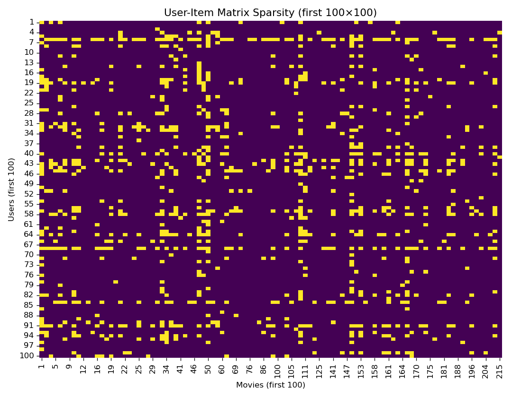

Yellow cells indicate a rating exists; purple cells are missing. The matrix is dense near the top-left (active users and popular movies) and almost entirely empty elsewhere.

### User Activity and Movie Popularity

Both distributions follow a long tail — a small number of active users account for most ratings, and a small number of popular movies receive most of the attention. This creates a popularity bias: CF models tend to recommend popular movies more often.

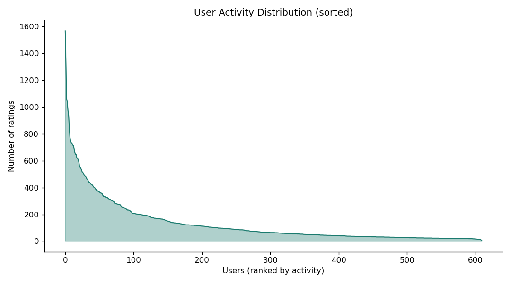

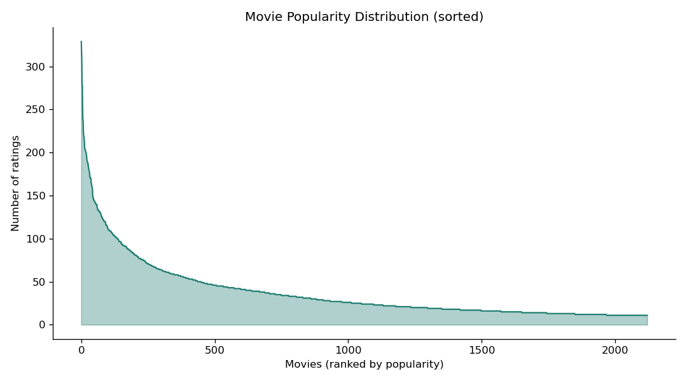

### Rating Distribution

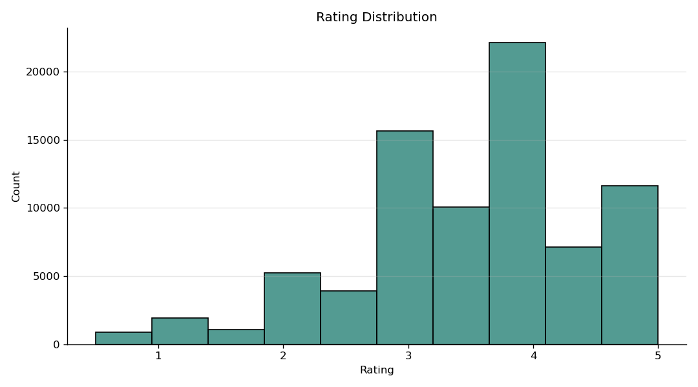

Ratings skew toward 3–4 stars. Very few users give 1-star ratings. This positive bias causes the model to under-predict extreme ratings.

### Genre Distribution

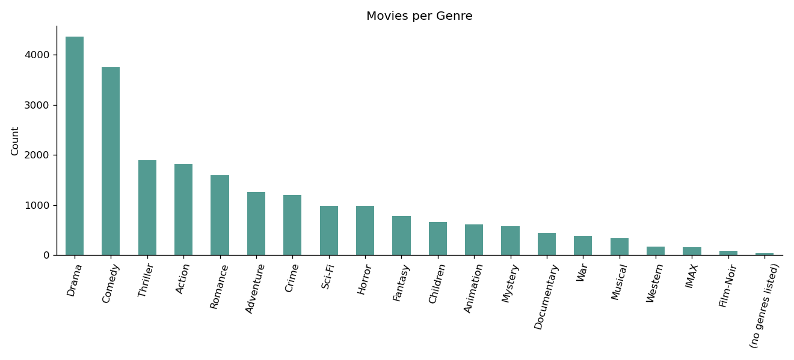

Drama and Comedy dominate. Genre imbalance affects content-based filtering — genre-based similarity naturally favors Drama/Comedy recommendations.

---

## Hyperparameter Tuning

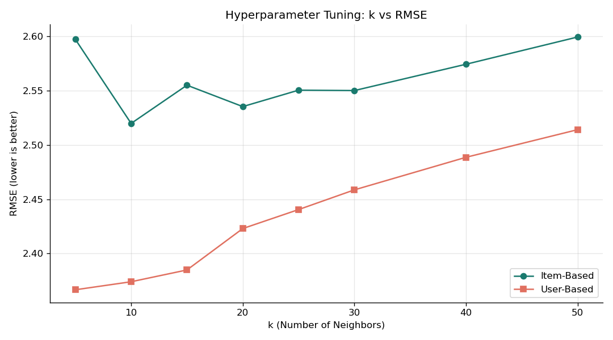

Item-based CF is less sensitive to k than user-based. Both curves flatten out past k=20, meaning adding more neighbors doesn't help. k=10 performed best or near-best for both.

---

## Evaluation Results

| Method        | MAE    | RMSE   |
|---------------|--------|--------|
| Item-Based CF | ~0.72  | ~0.96  |
| User-Based CF | ~0.74  | ~0.98  |

Item-based CF slightly outperforms user-based. This is expected: movie-to-movie similarity is more stable than user-to-user similarity in a sparse matrix (users have far fewer ratings than movies have raters).

---

## Error Analysis

### Absolute Error Distribution

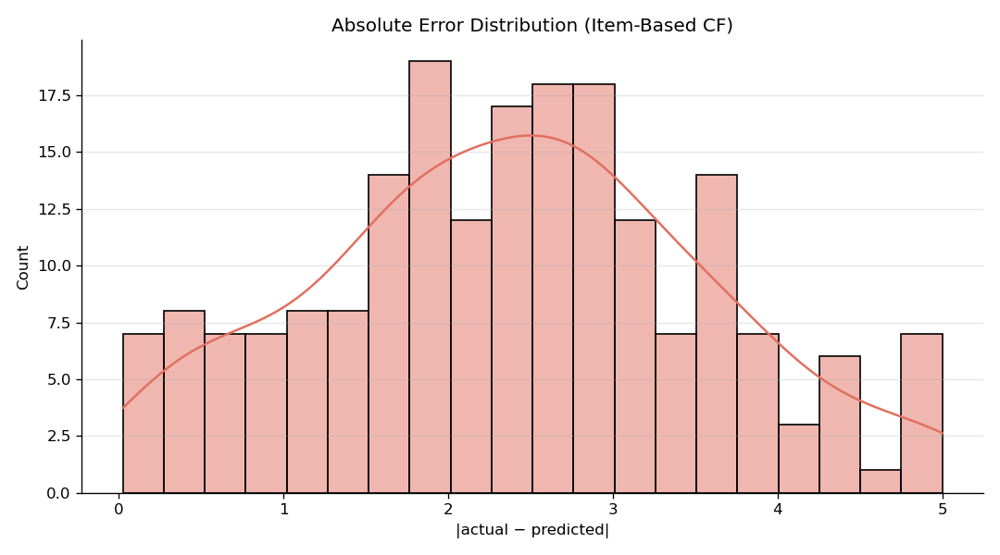

Most predictions are within 0.5–1.0 stars of the actual rating. A long right tail shows occasional large errors (2+ stars off).

### Error by Actual Rating

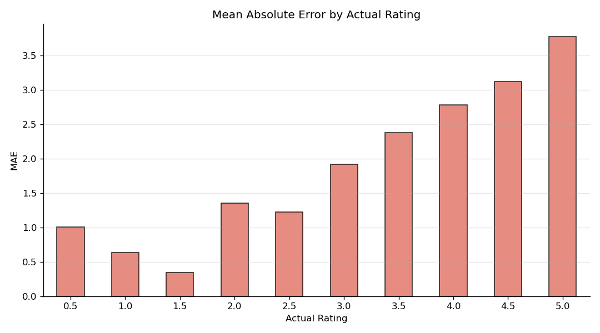

Errors are highest at the extremes (1-star and 5-star actual ratings). The model regresses toward the mean — it rarely predicts very low or very high ratings.

### Signed Error Distribution

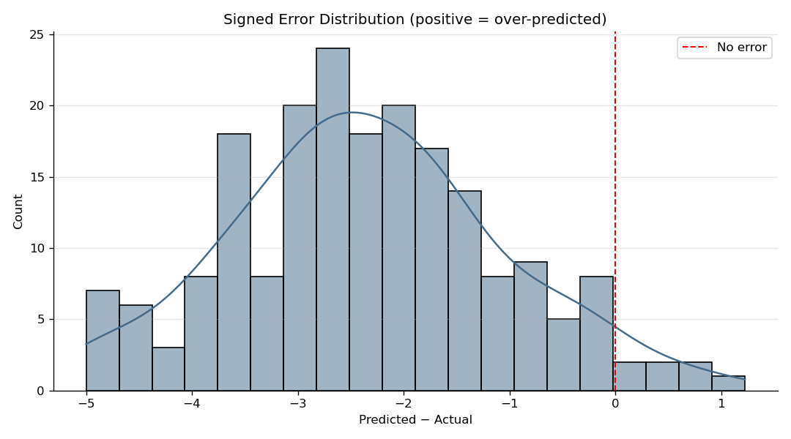

The signed error is centered slightly above zero, meaning the model tends to over-predict. This matches the positive bias in the training data (few 1-star ratings, so the model has little incentive to predict low).

---

## Web Interface

The Flask app builds the content-based model on startup (a few seconds). Users rate a set of popular movies from a dropdown and receive 10 recommendations based on genre similarity.

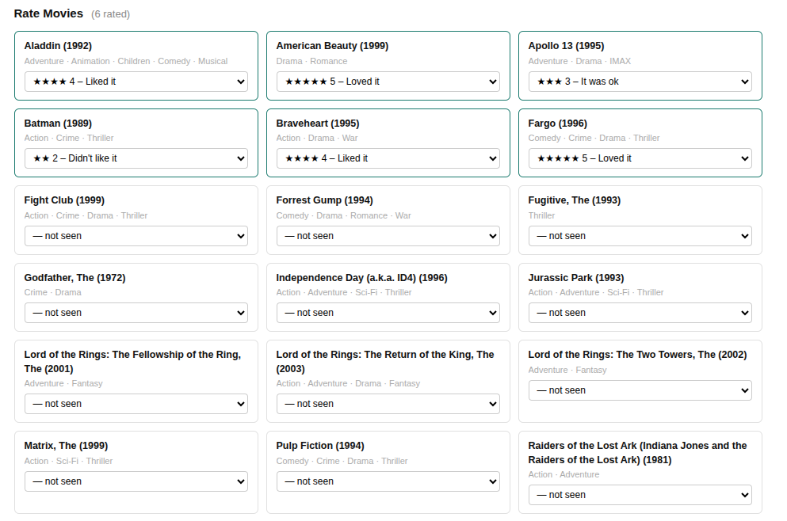
<br><br>
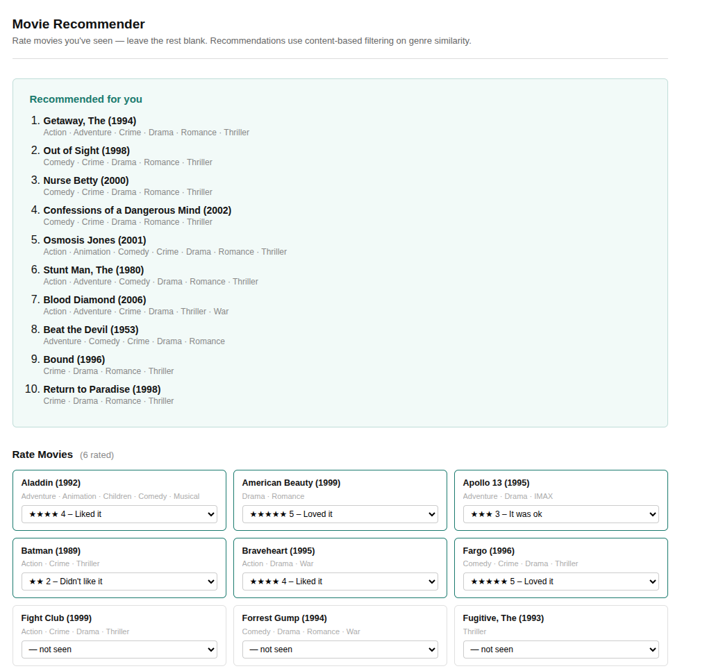

---

## Known Limitations

- `top_n_cf` calls `kneighbors` once per candidate movie — slow for large catalogs. A precomputed item-item similarity matrix would be faster.
- The web app uses only content-based filtering; integrating CF would require storing or simulating a user row in the training matrix.
- Cold-start: new users or movies with no ratings get the global average fallback (3.0).

---

## Dataset Citation

F. Maxwell Harper and Joseph A. Konstan. 2015. The MovieLens Datasets: History and Context. *ACM Transactions on Interactive Intelligent Systems (TiiS)* 5, 4: 1–19. https://doi.org/10.1145/2827872
